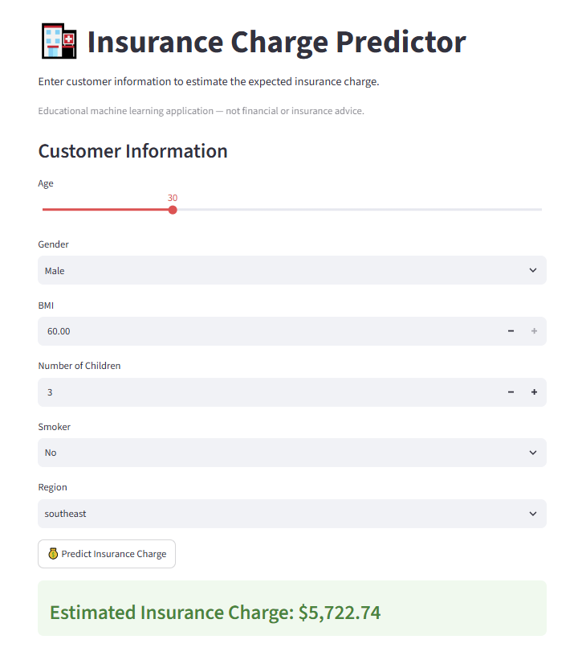

# 🏥 Insurance Charge Predictor

A machine learning web application that estimates individual medical insurance charges based on personal and demographic attributes such as age, BMI, smoking status, number of children, and region. Built with **scikit-learn** for modeling and **Streamlit** for the interactive front end.

> Educational machine learning project — not financial or insurance advice.


## 📌 Overview

Medical insurance charges vary significantly across individuals due to a combination of lifestyle and demographic factors. This project walks through a complete, end-to-end machine learning workflow — from raw data to a deployed prediction app:

1. Data cleaning and exploratory data analysis (EDA)
2. Feature engineering and encoding
3. correlation analysis
4. Model comparison, cross-validation, and hyperparameter tuning
5. Deployment as an interactive Streamlit web app

## 📂 Project Structure

```
insurance_charge_project/
├── data/
│   └── insurance.csv              # Raw dataset
├── doc/
│   └── app_scr.PNG                # App screenshot
├── notebook/
│   └── data_cleaning.ipynb        # EDA, feature engineering & model training
├── app.py                         # Streamlit web application
├── feature_columns.pkl            # Serialized feature column order
└── insurance_charge_model.pkl     # Trained regression model
```

## 🗃️ Dataset

The dataset contains **1,338 records** (1,337 after de-duplication) with the following features:

| Column     | Description                                  |
|------------|-----------------------------------------------|
| `age`      | Age of the individual                         |
| `sex`      | Gender (male / female)                        |
| `bmi`      | Body Mass Index                               |
| `children` | Number of dependents/children                 |
| `smoker`   | Smoking status (yes / no)                     |
| `region`   | Residential region (US)                       |
| `charges`  | Medical insurance cost (target variable)      |

## 🔍 Methodology

**Data Cleaning & EDA**
- Removed duplicate records and confirmed there were no missing values
- Analyzed distributions of numeric features (age, BMI, children, charges) via histograms, count plots, and box plots
- Identified outliers in `bmi` and `charges` using box plots
- Explored feature relationships using a correlation heatmap

**Feature Engineering** *(for business/exploratory analysis)*
- Binned `age` into categories (Young Adult, Adult, Middle Age, Older Adult)
- Binned `bmi` into standard health categories (Underweight, Normal, Overweight, Obese)
- Compared average `charges` across `age_category` and `bmi_category` groups to surface business-friendly insights

**Data Preprocessing**
- Encoded `sex` and `smoker` as binary flags (`isfemale`, `issmoker`)
- One-hot encoded `region` into four binary columns


**Modeling**
- Split data into an 80/20 train-test set
- Trained and compared four regression models: **Linear Regression**, **Ridge Regression**, **Random Forest**, and **Gradient Boosting**
- Evaluated each with **MAE**, **RMSE**, and **R²**, then validated with **5-fold cross-validation**
- Selected **Gradient Boosting** as the best-performing model and fine-tuned it with **GridSearchCV** (tuning `n_estimators`, `learning_rate`, `max_depth`)
- Saved the final tuned model and its feature column order with `joblib`

## 📊 Results


**Final tuned model (after GridSearchCV, best params: `learning_rate=0.05`, `max_depth=4`, `n_estimators=100`):**

| Metric | Score     |
|--------|-----------|
| MAE    | 2,474.99  |
| RMSE   | 4,263.35  |
| R²     | 0.901     |

`issmoker` proved to be the strongest individual predictor of insurance charges (Pearson r ≈ 0.79), followed by `age` and `bmi`.

## 🖥️ Application

The trained model is deployed via a **Streamlit** app that lets users enter customer details — age, gender, BMI, number of children, smoker status, and region — and instantly receive an estimated insurance charge.



## 🛠️ Tech Stack

- **Python** — Pandas, NumPy
- **Visualization** — Matplotlib, Seaborn
- **Machine Learning** — scikit-learn (Linear Regression, Ridge, Random Forest, Gradient Boosting, GridSearchCV, cross-validation)
- **Model Persistence** — Joblib
- **Web App** — Streamlit

🚀 Getting Started
1. Clone the repository
bash
git clone https://github.com/bithiNath/insurance-charge-predictor.git
cd insurance-charge-predictor
2. Install dependencies
bash
pip install streamlit pandas joblib scikit-learn
3. Run the app
bash
streamlit run app.py

Make sure insurance_charge_model.pkl and feature_columns.pkl are in the same directory as app.py — the app loads them at startup.

The app will open in your browser at http://localhost:8501.

## 📁 Notebook

The full data cleaning, EDA, feature engineering, feature selection, and model training workflow is documented in [`notebook/data_cleaning.ipynb`](notebook/data_cleaning.ipynb).

## 📄 License

This project is intended for educational purposes.

## 👤 Author

- **GitHub:** [@bithiNath](https://github.com/bithiNath)
- **LinkedIn:** [Bithi Nath](https://linkedin.com/in/bithinath)


 <br>
 

-----
<p align="center">⭐ If you found this project helpful, please consider giving it a star on GitHub!</p>


<p align="center">Developed by <a href="https://github.com/bithiNath">@bithiNath</a> ⚡</p>

